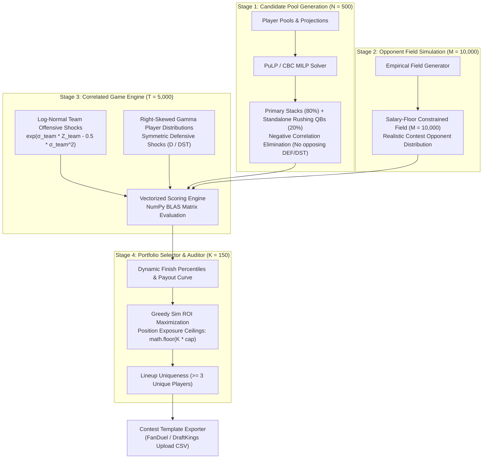

# NFL DFS Optimization Engine

[](https://github.com/kel-reid/DFS-Optimizer/actions/workflows/ci.yml)
[](https://codecov.io/github/kel-reid/DFS-Optimizer)
[](https://www.python.org/)

A quantitative optimization and Monte Carlo simulation engine for generating high-equity tournament portfolios for FanDuel and DraftKings NFL DFS contests.

> **Key DFS Concepts**:
> * **MME (Mass Multi-Entry)**: Generating a coordinated portfolio of 150 lineups to capture ceiling outcomes in 150-max contests.
> * **GPP (Guaranteed Prize Pool)**: Large-field, top-heavy tournament payout structures where high percentiles (top 0.01%–1.0%) capture the majority of prize equity.


## Architecture: 4-Stage Monte Carlo Simulation Pipeline

Both FanDuel and DraftKings leverage the shared four-stage quantitative pipeline:




## Simulation Dimensions: N = 500, M = 10,000, T = 5,000, K = 150

The Monte Carlo simulation pipeline parameterizes scale across four distinct mathematical dimensions:

* **N = 500 Candidate Lineups (`--num-candidates`)**:
  * The MILP solver generates a broad pool of 500 structurally viable, high-ceiling candidates (80% primary stacked, 20% unconstrained rushing QBs).
* **M = 10,000 Opponent Field Lineups (`--num-field`)**:
  * Models the realistic opponent field distribution using salary-floor constrained sampling and ownership baselines to benchmark percentile finish thresholds.
* **T = 5,000 Game Slate Trials (`--num-trials`)**:
  * Independent simulated realizations of the game slate with right-skewed Gamma distributions and log-normal team offensive shocks $\exp(\sigma_{\text{team}} Z_{\text{team}} - 0.5\sigma_{\text{team}}^2)$.
* **K = 150 Portfolio Lineups (`--num-lineups`)**:
  * The target entry portfolio size exported to the contest template (standard FanDuel/DraftKings 150-max MME contests).


## Strategic & Quantitative Constraints

1. **Roster Architecture & Salary Cap**:
   * **Classic Formats**:
     * **FanDuel Classic**: 9 players (`QB, RB, RB, WR, WR, WR, TE, FLEX, DEF`) under **$60,000** salary cap (players from $\ge 3$ distinct teams).
     * **DraftKings Classic**: 9 players (`QB, RB, RB, WR, WR, WR, TE, FLEX, DST`) under **$50,000** salary cap (players from $\ge 2$ distinct teams).
   * **Single Game / Showdown Formats**:
     * **FanDuel Single Game**: 5 players (1 `MVP` at $1.5\times$ scoring multiplier + 4 `AnyFLEX`) under **$60,000** salary cap (players from $\ge 2$ teams).
     * **DraftKings Showdown**: 6 players (1 `CPT` at $1.5\times$ salary and scoring multiplier + 5 `FLEX`) under **$50,000** salary cap (players from $\ge 2$ teams).

2. **Primary Correlation Stacking (80 / 20 Allocation)**:
   * **Phase 1 (80% / 120 lineups)**: Enforces QB + $\ge 1$ Pass Catcher (`WR` or `TE`) from the same franchise using `PositionsStack`.
   * **Phase 2 (20% / 30 lineups)**: Solves unconstrained rosters, enabling standalone rushing quarterbacks (e.g. Josh Allen, Lamar Jackson) without forced pass-catcher pairings.

3. **Negative Correlation Elimination**:
   * Strictly prohibits rostering defensive units (`DEF` / `DST`) with opposing offensive skill players (`QB`, `RB`, `WR`, `TE`) using `restrict_positions_for_opposing_team`.

4. **Lineup Uniqueness**:
   * For 9-player Classic formats, enforcing `max_repeating_players = 6` guarantees that every lineup in the 150-entry portfolio differs by at least **3 unique players** from every other lineup.

5. **Pre-Solve Injury & Backup QB Filter**:
   * Prunes confirmed `IR`, `O`, `D`, and `PUP` players while retaining active and Questionable (`Q`) starters.
   * Zeroes out projected points (`FPPG = 0.0`) for non-starting backup QBs (configured in `config/settings.yaml`) so the solver allocates 100% of QB volume exclusively to active starting quarterbacks.

6. **Portfolio Risk & Diversity Controls**:
   * **Position Exposure Ceilings**:
     * Starting QBs: Max **25%** (max 37 / 150 lineups, distributed across 8–11 starting QBs)
     * Team Defenses: Max **20%** (max 30 / 150 lineups, distributed across 9–10 defenses)
     * Flex Running Backs, Wide Receivers, Tight Ends: Max **25%** (max 37 / 150 lineups)
   * **Monte Carlo Ceiling Diversity**:
     * Applies `RandomFantasyPointsStrategy` with $\pm 25.0\%$ stochastic deviation to simulate variance and create an organic, descending exposure curve.

7. **Normalized GPP Percentile Payout Structure**:
   * Ranks candidates against the field distribution across 5,000 Monte Carlo game trials using `np.searchsorted`.
   * Dynamic finish percentiles adaptable to any contest size and entry fee:
     * **Top 0.01%** (1st place tier): **10,000x** entry fee
     * **Top 0.1%** (Elite tier): **500x** entry fee
     * **Top 1.0%** (High equity tier): **20x** entry fee
     * **Top 5.0%** (Mid cash tier): **5x** entry fee
     * **Top 20.0%** (Min-cash line): **1.5x** entry fee
   * **Contest-Agnostic Entry Fee Resolution**:
     * Automatically detects entry fee from template CSV column headers (`Entry Fee`, `entry_fee`, `Fee`).
     * Supports environment variable overrides (`DFS_ENTRY_FEE`, `DFS_DK_ENTRY_FEE`) and CLI `--entry-fee` flag.
     * Defaults to a neutral **$1.00** baseline if unstated, allowing seamless scaling across any buy-in tier ($0.05 micro-stakes to $100+ high-stakes).


## Configuration Architecture (`config/settings.yaml`)

Quantitative parameters, exposure caps, and domain filters are decoupled from source code into `config/settings.yaml`:

```yaml
global:
  backup_quarterbacks:   # Externalized backup QBs zeroed out at ingestion
    - "Tyrod Taylor"
    - "Drew Lock"
  random_seed: 42

fanduel:
  default_entry_fee: 1.00
  simulation:
    num_candidates: 500
    num_field_lineups: 10000
    num_sim_trials: 5000
    num_selected_lineups: 150
  exposure_caps:
    max_qb_exposure: 0.25
    max_rb_exposure: 0.25
    max_def_exposure: 0.20

draftkings:
  salary_cap: 50000
  min_field_salary: 48500
  default_entry_fee: 1.00
  simulation:
    num_candidates: 500
    num_field_lineups: 10000
    num_sim_trials: 5000
    num_selected_lineups: 150
```

Supported configuration parameters can be overridden via environment variables (e.g. `DFS_SALARY_CAP`, `DFS_MIN_FIELD_SALARY`, `DFS_ENTRY_FEE`, `DFS_NUM_CANDIDATES`, `DFS_NUM_FIELD`, `DFS_NUM_TRIALS`, `DFS_NUM_LINEUPS`, `DFS_MAX_QB_EXPOSURE`, `DFS_MAX_DEF_EXPOSURE`, `DFS_BACKUP_QUARTERBACKS`, and corresponding `DFS_DK_*` variables).


## Setup & Execution

### 1. Local Environment Setup

```bash
# Clone repository
git clone https://github.com/kel-reid/DFS-Optimizer.git
cd DFS-Optimizer

# Create virtual environment
python3 -m venv .venv
source .venv/bin/activate

# Install dependencies
pip install -r requirements.txt
```

### 2. Intelligent Auto-Detection Launcher

The unified launcher inspects file signatures in `data/templates/`, `data/players/`, and `data/` to automatically detect whether the slate is FanDuel or DraftKings and routes execution through the simulation pipeline:

```bash
# Auto-detects target platform and launches the 4-stage pipeline:
python run_optimizer.py

# Or via executable wrapper:
./run_optimizer
```

### 3. Containerized Execution (Docker & Docker Compose)

The engine is fully containerized with CBC solver binaries pre-installed:

```bash
# Run using Docker Compose (mounts local data/ and config/ directories):
docker compose run --rm optimizer

# Or build and execute standalone container:
docker build -t dfs-optimizer .
docker run --rm -v $(pwd)/data:/app/data -v $(pwd)/config:/app/config dfs-optimizer
```

### 4. Direct Platform Execution & Custom Flags

You can also run platform-specific pipelines directly with fine-grained simulation flags:

#### FanDuel Direct Execution

```bash
# Run Sunday Night Single Game (auto-detects 1.5x MVP Showdown format)
python src/build_fanduel_lineups.py --week 5 --slate sunday-night

# Run Main Slate with explicit simulation parameters
python src/build_fanduel_lineups.py --week 5 --slate main-slate --num-candidates 500 --num-trials 5000 --entry-fee 1.00
```
*Export destination: `data/week-<XX>/<slate>/completed_lineups.csv` when that slate directory exists; otherwise `data/output/<slate>/Completed-<template filename>`.*

#### DraftKings Direct Execution

```bash
# Run DraftKings with automatic template fee detection
python src/build_draftkings_lineups.py

# Run with explicit paths and simulation overrides:
python src/build_draftkings_lineups.py \
  --players-csv data/players/DKSalaries.csv \
  --template-csv data/templates/DKEntries.csv \
  --num-candidates 500 \
  --num-trials 5000 \
  --entry-fee 3.00
```
*Export destination: `data/output/Completed-DKEntries.csv`.*


## Quality Verification & Tests

Run the full automated test suite, linter, and type checker before committing:

```bash
# Run all unit and integration tests
.venv/bin/pytest -v

# Run linter
ruff check .

# Run static type checker
mypy src tests
```
